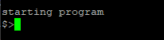
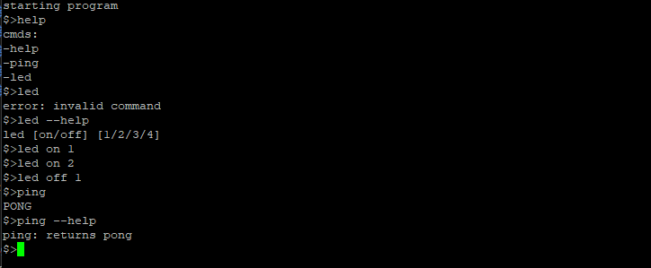

# UART-CMD

A UART-based command interface project for the **Tang Nano 9K FPGA** board.  
This project implements a simple command line interface throught serial command protocol.

Allows to add new commands easily using the cmd structure.

Was built with not AI [only few small questions] (today its a flex).

---

## Hardware Requirements

- **Tang Nano 9K FPGA board**
- USB-C cable (for programming and UART communication)

---

## Software Requirements

- [Gowin FPGA Designer IDE](https://www.gowinsemi.com/en/support/download/)
- Serial terminal software (e.g. PuTTY, screen, minicom)

---

## UART Configuration

| Parameter  | Value   |
|------------|---------|
| Baud Rate  | 115200  |
| Data Bits  | 8       |
| Stop Bits  | 1       |
| Parity     | None    |

---

## Command Examples

| Command                  | Description          | 
|--------------------------|----------------------|
| `help`                   | Prints commands      | 
| `help --help`            | print help for help  | 
| `ping`                   | returns `PONG`       | 
| `ping --help`            | print help for ping  | 
| `led [on/off] [1/2/3/4]` | turns leds on or off | 
| `led --help`             | print help for led   | 

